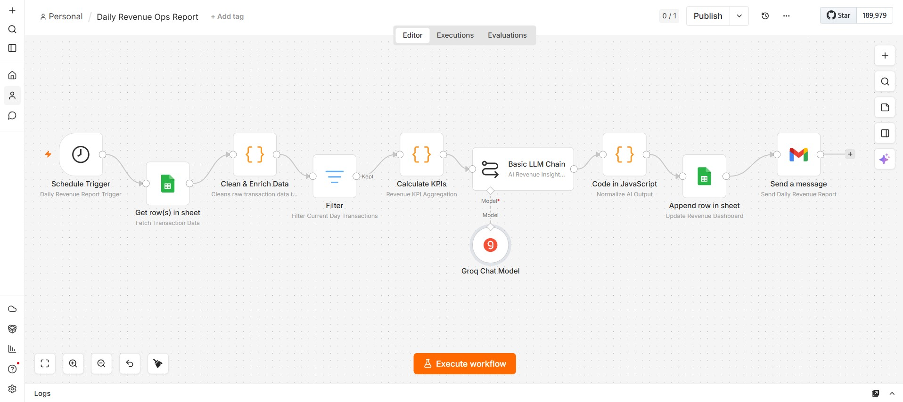
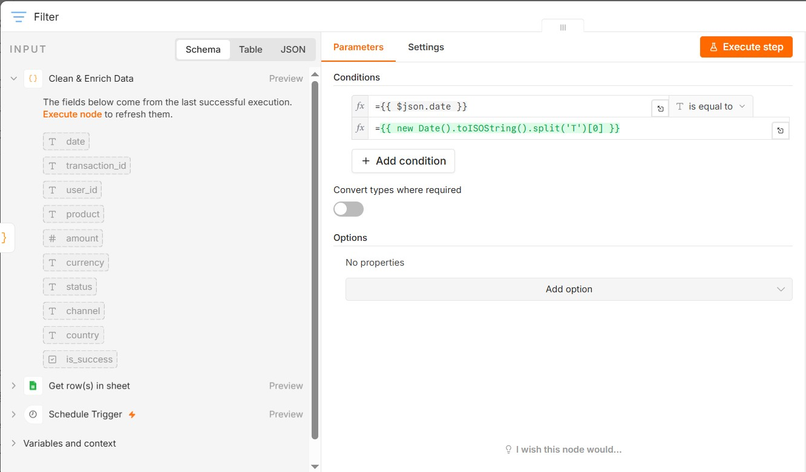
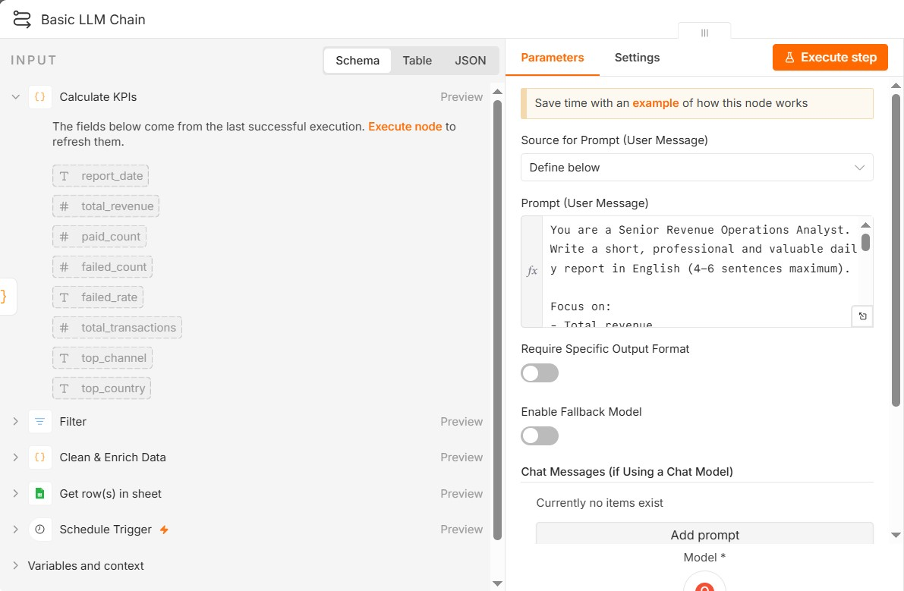
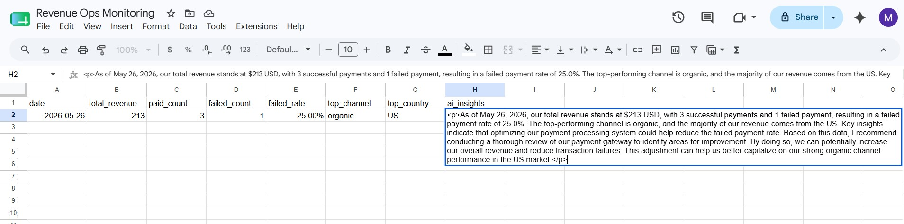
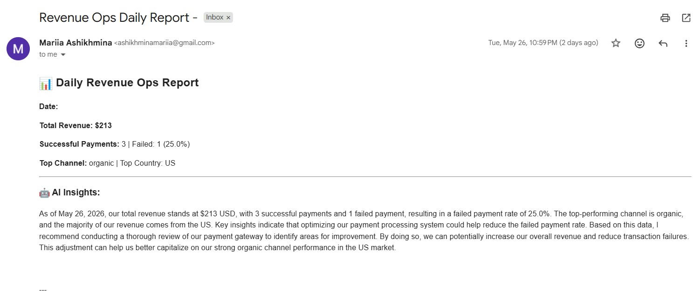

# 📊 Daily Revenue Ops Report — n8n Automation

> An end-to-end automated Revenue Operations reporting pipeline built in **n8n**, powered by **Groq LLM** and **Google Sheets**, delivering daily AI-generated insights straight to your inbox.

---

## 🚀 Overview

This workflow runs every day on a schedule, pulls transaction data from Google Sheets, calculates key revenue KPIs, generates an AI-written analyst summary via Groq LLM, writes results back to a dashboard sheet, and sends a formatted HTML email report — fully automatically, zero manual effort.

**Stack:** n8n · Google Sheets · Groq (LLaMA) · Gmail/SMTP · JavaScript

---

## 🔁 Workflow Architecture

```
Schedule Trigger
      │
      ▼
Get Rows (Google Sheets — "transaction" sheet)
      │
      ▼
Code: Clean & Enrich Data
      │
      ▼
Filter: Today's Transactions Only
      │
      ▼
Code: Calculate KPIs
      │
      ▼
Basic LLM Chain (Groq Chat Model — LLaMA 3)
      │
      ▼
Code: Extract AI Insights Text
      │
      ├──▶ Append Row to Dashboard Sheet
      │
      └──▶ Send Email (HTML Report)
```

---

## 📋 Nodes Breakdown

### 1. Schedule Trigger
Fires the workflow at a configured time each day (e.g., 12:00 PM). No manual intervention needed.

### 2. Get Rows — Google Sheets
Reads all rows from the **Revenue Ops Monitoring** workbook, **transaction** sheet.

**Sample data schema:**

| date | transaction_id | user_id | product | amount | currency | status | channel | country |
|------|---------------|---------|---------|--------|----------|--------|---------|---------|
| 2026-05-20 | t_1001 | u_01 | subscription_basic | 25 | USD | paid | google_ads | GE |
| 2026-05-20 | t_1004 | u_04 | subscription_basic | 3 | USD | failed | google_ads | GE |

### 3. Code — Clean & Enrich Data
Normalizes raw sheet values: trims whitespace, parses amounts to float, lowercases status, and adds a boolean `is_success` flag.

### 4. Filter — Today Only
Keeps only rows where `date` equals today's date (`new Date().toISOString().split('T')[0]`), ensuring the report is always day-specific.

### 5. Code — Calculate KPIs
Aggregates the filtered transactions into a single KPI object:
- `total_revenue` — sum of all paid transaction amounts
- `paid_count` / `failed_count` — transaction counts by status
- `failed_rate` — percentage of failed transactions
- `top_channel` — channel with the highest revenue
- `top_country` — country with the highest revenue

### 6. Basic LLM Chain — Groq (LLaMA 3)
Sends KPI data to Groq's LLaMA model with a structured Revenue Analyst prompt. Returns a 4–6 sentence professional commentary with insights and recommendations.

**Prompt used:**
```
You are a Senior Revenue Operations Analyst.
Write a short, professional and valuable daily report in English (4–6 sentences maximum).

Focus on:
- Total revenue
- Failed payment rate
- Top channel and country
- Key insights and actionable recommendations

Tone: professional, data-driven, concise.

Here is today's revenue data:

Date: {{ $json.report_date }}
Revenue: {{ $json.total_revenue }} USD
Successful Payments: {{ $json.paid_count }}
Failed Payments: {{ $json.failed_count }}
Failure Rate: {{ $json.failed_rate }}
Total Transactions: {{ $json.total_transactions }}
Top Channel: {{ $json.top_channel }}
Top Country: {{ $json.top_country }}

Reply in English only.
```

### 7. Code — Extract AI Insights
Handles variable LLM response structures and extracts the plain text insight into `ai_insights` field while preserving all upstream KPI fields.

### 8. Append Row — Dashboard Sheet
Writes today's KPIs + AI insights into the **dashboard** sheet of the same Google Sheets workbook for historical tracking.

### 9. Send Email — HTML Report
Delivers a formatted HTML email with all KPIs and the AI commentary.

**Email subject:** `Revenue Ops Daily Report - {{ $json.report_date }}`

---

## 📧 Sample Email Output

```
📊 Daily Revenue Ops Report

Date: 2026-05-26
Total Revenue: $213.00
Successful Payments: 3 | Failed: 1 (25.0%)
Top Channel: organic | Top Country: US

🤖 AI Insights:
Today's revenue performance showed moderate results with $213 collected
across 4 transactions. The 25% failure rate is above acceptable thresholds
and warrants immediate investigation into the facebook_ads channel...
```

---

## ⚙️ Setup Requirements

### Prerequisites
- [n8n](https://n8n.io/) instance (self-hosted or cloud)
- Google account with Google Sheets access
- [Groq API key](https://console.groq.com/) (free tier available)
- Gmail account or SMTP credentials for email delivery

### Credentials Needed in n8n
| Credential | Used In |
|-----------|---------|
| Google Sheets OAuth2 | Get Rows, Append Row |
| Groq API Key | Basic LLM Chain |
| Gmail / SMTP | Send Email |

---

## 🗂️ Google Sheets Structure

**Workbook:** `Revenue Ops Monitoring`

**Sheet 1 — `transaction`** (input data):
`date | transaction_id | user_id | product | amount | currency | status | channel | country`

**Sheet 2 — `dashboard`** (output — appended daily):
`date | total_revenue | paid_count | failed_count | failed_rate | top_channel | top_country | ai_insights`

---

## 📸 Screenshots

### Full Workflow Canvas


### Filter Node Configuration


### LLM Chain with Prompt


### Dashboard Sheet Output


### Sample Email Report


---

## 💡 Key Design Decisions

- **Date filtering at runtime** — the workflow always processes only today's data, making it safe to run against a growing historical sheet without reprocessing old rows.
- **LLM as a layer, not the core** — KPI calculation is deterministic JavaScript; the LLM only adds narrative commentary, keeping the numbers reliable.
- **Dual output** — writing to both a dashboard sheet and email gives both a historical audit trail and real-time delivery.
- **Groq over OpenAI** — faster inference, generous free tier, ideal for scheduled automation.

---

## 🔧 How to Import & Run

1. Clone or download this repository
2. Open your n8n instance
3. Go to **Workflows → Import from File**
4. Upload `revenue_ops_report.json`
5. Configure credentials (Google Sheets, Groq, Gmail)
6. Update the Google Sheets node with your actual spreadsheet ID
7. Activate the workflow

> The workflow JSON file (`revenue_ops_report.json`) is included in this repository. Export it from n8n via **⋮ → Download**.

---

## 📁 Repository Structure

```
daily-revenue-ops-report/
├── README.md                    # This file
├── revenue_ops_report.json      # n8n workflow export
└── screenshots/
    ├── workflow_canvas.jpg
    ├── filter_node.jpg
    ├── llm_chain.jpg
    ├── dashboard_sheet.jpg
    └── email_sample.jpg
```

---

## 🏷️ Tags

`n8n` `automation` `revenue-operations` `google-sheets` `groq` `llm` `no-code` `workflow` `email-automation` `kpi` `data-pipeline` `portfolio`

---

## 👤 Author

Built as a portfolio project demonstrating end-to-end Revenue Operations automation using modern no-code/low-code tools and AI.
